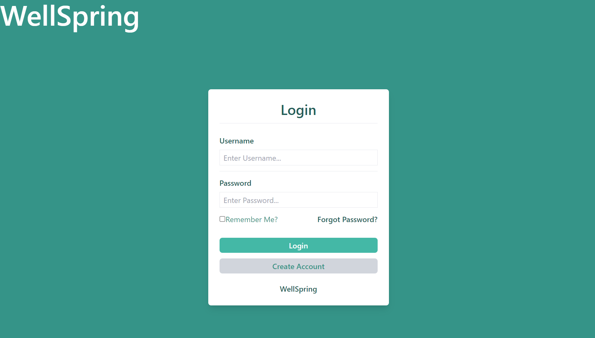
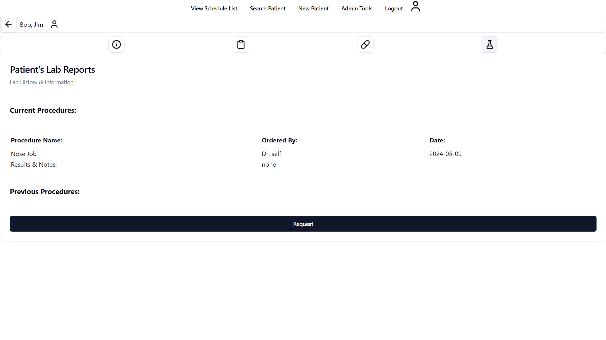
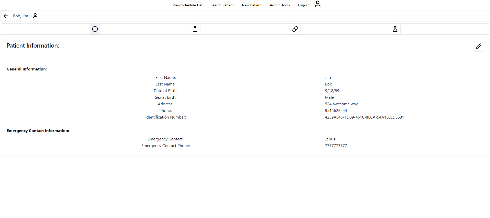

# Wellspring

**Wellspring** is a comprehensive healthcare management application designed to streamline the workflow of healthcare professionals, including doctors, nurses, and pharmacists. It provides a unified platform to manage patients, appointments, lab results, prescriptions, and medications.

> [!NOTE]  
> Please note that this is client side of the Wellspring application. You will need to set up the server side to use the application. The server side can be found [here](https://github.com/Sillor/wellspring-server).


> [!CAUTION]  
> Please note that the database files are not included in this project. You will need to create your own database and tables to use this server.





## Features

*   **Patient Management:** Maintain a detailed record of patient information, medical history, and ongoing treatments.
*   **Appointment Scheduling:** Efficiently schedule and manage appointments.
*   **Lab Result Management:** Track patient lab results and share them with relevant healthcare professionals.
*   **Prescription Management:** Create, update, and manage prescriptions for patients.
*   **Medication Management:** Keep an up-to-date record of medications prescribed to patients.

## Getting Started

To get started with Wellspring, ensure you have Node.js and npm installed on your system. Follow these steps to set up the project:

1.  **Clone the client repository:**
    ```bash
    git clone https://github.com/Sillor/wellspring-client
    ```

2.  **Clone the server repository:**
    ```bash
    git clone https://github.com/Sillor/wellspring-server
    ```

3.  **Navigate to the client project directory:**
    ```bash
    cd wellspring-client 
    ```

4.  **Install the client dependencies:**
    ```bash
    npm install
    ```

5.  **Navigate to the server project directory:**
    ```bash
    cd wellspring-server
    ```

6.  **Install the server dependencies:**
    ```bash
    npm install 
    ```

7.  **Start the development server (for both client and server):**
    
    *   **Client:** 
        ```bash
        npm run dev
        ```
    *   **Server:** 
        ```bash
        node wellspring_server.js
        ``` 

The application will be available at `http://localhost:5173`.

## License

Wellspring is licensed under the GNU General Public License v3.0.

## Contact and contributions

If you have any questions, issues, or suggestions, please open an issue on our [GitHub repository](https://github.com/Sillor/wellspring-client/issues) or contact us directly.

## Acknowledgements

Wellspring was created as part of the Spring 2024 CSC131 class at California State University, Sacramento.
